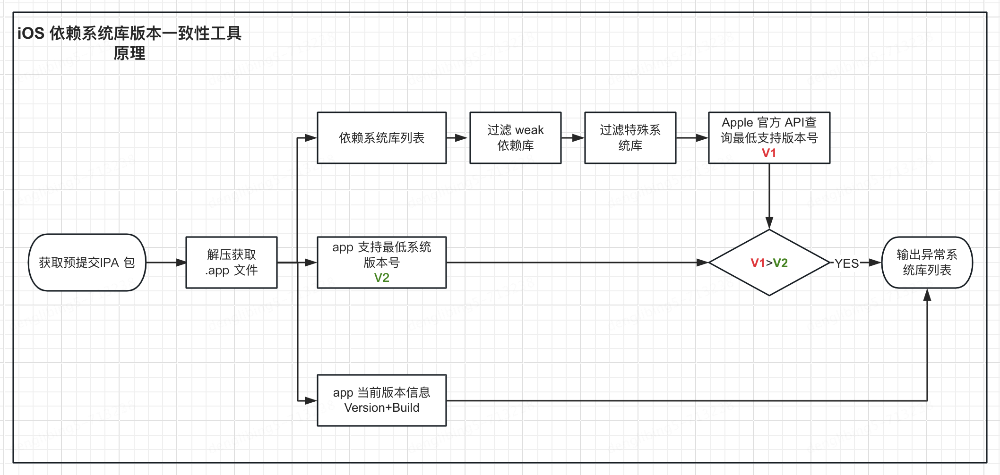

#  iOS依赖库版本一致性检测：确保应用兼容性

## 一、背景

在 `iOS` 应用开发的世界里，每次 `Xcode` 更新都带来了新的特性和挑战。最近的 `Xcode 15` 更新不例外，这次升级引入了对 `SwiftUI` 的自动强依赖。`SwiftUI`最低是从 `iOS 13` 开始支持。

这一变化也带来了潜在的兼容性问题。如果您的项目在升级到 `Xcode 15` 后仍需支持 `iOS 13` 以下版本，那么在这些旧设备上运行应用时，将不可避免地遇到崩溃问题。


## 二、问题

**`Xcode15` 升级后 `iOS13` 以下崩溃问题**

### 问题描述及原因

崩溃信息如下：

```
Exception Type:  EXC_CRASH (SIGABRT)
Exception Codes: 0x0000000000000000, 0x0000000000000000
Exception Note:  EXC_CORPSE_NOTIFY
Termination Description: DYLD, Library not loaded: /System/Library/Frameworks/SwiftUI.framework/SwiftUI | Referenced from: /var/containers/Bundle/Application/E96C2AC1-F3D8-4A70-8FDE-FA34A0C73AD3/JDMobileLite.app/JDMobileLite | Reason: image not found
Triggered by Thread:  0
```

Xcode15 默认会在 `Build Setting` 添加 `ASSETCATALOG_COMPILER_GENERATE_ASSET_SYMBOL_FRAMEWORKS` 选项，默认值为：

```
SwitUI UIKit AppKit
```

因为 SwiftUI 是从 iOS13 开始支持，这样导致在以下的设备上运行会崩溃。

官方文档如下：

https://developer.apple.com/documentation/xcode-release-notes/xcode-15-release-notes


### 问题解决

检查一下Asset Catalog Compiler这一项 Generate Swift Asset Symbol Framework Support，把SwiftUI去掉

 


### 问题解决复查

1、重新出包，使用 iOS13以下 的设备安装运行验证；

2、使用 otool 检测 ipa 中的二进制验证：

问题解决前数据如下：

```
$ otool -L JDMobileLite
JDMobileLite:
        ...
        ...
	/System/Library/Frameworks/QuickLook.framework/QuickLook (compatibility version 1.0.0, current version 946.3.2)
	/System/Library/Frameworks/SwiftUI.framework/SwiftUI (compatibility version 1.0.0, current version 5.2.12)
	/System/Library/Frameworks/UserNotifications.framework/UserNotifications (compatibility version 1.0.0, current version 1.0.0)
	...
        ...
```

问题解决后数据如下：

```
$ otool -L JDMobileLite
JDMobileLite:
        ...
        ...
	/System/Library/Frameworks/QuickLook.framework/QuickLook (compatibility version 1.0.0, current version 946.3.2)
	/System/Library/Frameworks/UserNotifications.framework/UserNotifications (compatibility version 1.0.0, current version 1.0.0)
	...
        ...
```

解决方案参考：

https://forums.developer.apple.com/forums/thread/126506

https://stackoverflow.com/questions/57907817/dyld-library-not-loaded-swiftui-when-app-runs-on-ios-12-using-availableios-13


## 三、规避工具

随着 `Xcode` 和 `iOS SDK` 的不断更新，我们作为开发者，面临着一个持续的挑战：确保我们的应用在旧版本的iOS上仍然能够稳定运行。这一挑战的核心在于保持 ***App支持的最低系统版本号*** 与 ***项目依赖的系统库支持最低版本号*** 的一致性。这不仅仅是一个单次的修复问题，而是需要一个系统化的解决方案来持续监控和解决这一问题。以下是实现这一目标的三个关键思路：

**1、如何获取到 App 支持的最低系统版本号？**

每一个 `App` 中都会有一个 `info.plist` 文件，这里通过 `plistlib` 读取该 `App` 支持的最低系统版本号及当前 `App` 的版本信息，脚本如下：

```python
def read_minimum_os_version(app_path):
    info_plist_path = app_path + "/" + "info.plist"
    try:
        with open(info_plist_path, 'rb') as f:
            data = plistlib.load(f)
        return data.get('MinimumOSVersion'), data.get('CFBundleShortVersionString'), data.get('CFBundleVersion')
    except (KeyError, FileNotFoundError):
        return None
```


**2、如何获取 App 依赖的系统库列表？**

这里需要使用到 `otool` 工具的能力，依赖 `bash` 环境，脚本代码如下：

```sh
#!/bin/bash
# otool.sh

file_path=$1
otool -L $file_path
```

`Python` 通过 `subprocess` 执行 `otool.sh` 并获取依赖系统库列表：

```python
def system_frameworks_list(app_path):
    filename = os.path.basename(app_path)
    filename, extension = os.path.splitext(filename)
    macho_path = app_path + "/" + filename
    result = subprocess.run(["sh", "otool.sh", macho_path], stdout=subprocess.PIPE)
    # 检查命令是否成功执行
    if result.returncode == 0:
        # 将输出解码为字符串
        output_str = result.stdout.decode('utf-8')

        # 打印输出
        print("\t执行 sh 脚本获取系统列表信息成功")
        frameworks = extract_frameworks(output_str)
        return frameworks
    else:
        print(f"\t执行脚本失败，退出状态码：{result.returncode}")
        return None
```


**3、如何获取这些系统库最低支持的系统版本号？**

通过查询资料，Apple 是有开放 API 进行查询，查询方式为：https://developer.apple.com/tutorials/data/documentation/{frameworkname}.json

解析可获取对应库的最低支持系统版本号。

需要留意的是，如下库需要过滤：

```python
def ignore_frameworks():
    # OpenAL（Open Audio Library）是一个跨平台的开放源代码音频库，它提供了一组接口，
    # 使得游戏开发者能够更方便地处理音频。
    # OpenAL 提供了诸如3D声音定位、回声效果、混响效果等功能，使得游戏开发者能够创建更加逼真的音效体验。
    # https://www.openal.org/platforms/ 查询得到 iOS 开发中是在 Core Audio 中，而 Core Audio从 iOS2就开始支持

    # MobileCoreServices框架使用统一类型标识符（UTI）信息来创建和操作可以在您的应用和其他应用和服务之间交换的数据。
    # 底层直接引用 CoreServices，MobileCoreServices支持
    # 支持的最低系统版本，这个框架自 iOS 的早期版本就已经存在，并且随着操作系统的每次更新而得到更新和维护

    # WebKit 和 JavaScriptCore 在 iOS7就开始支持，但是有一些特性API会有版本限制，不再系统库这一层级去考虑
    return ["OpenAL", "MobileCoreServices", "WebKit", "JavaScriptCore"]
```

工具实现的流程：




## 四、工具使用

执行 `main.py`， 并传入 `app` 包的路径即可

```sh
$ python3 main.py -f /Users/denglibing/Downloads/JDMOBILELITE-V6.0.0-100-1337-APPSTORE-d0e2839a/Payload/JDMobileLite.app

==Step1 解析参数
        app_path: /Users/denglibing/Downloads/JDMOBILELITE-V6.0.0-100-1337-APPSTORE-d0e2839a/Payload/JDMobileLite.app
        output: /Users/denglibing/Downloads/JDMOBILELITE-V6.0.0-100-1337-APPSTORE-d0e2839a/Payload

==Step2 通过 sh 脚本获取该 app 依赖的系统库列表（剔除 weak 依赖)）
        执行 sh 脚本获取系统列表信息成功
        系统库列表: ['AVFoundation', 'Accelerate', 'AdSupport', 'AddressBook', 'AddressBookUI', 'AssetsLibrary', 'AudioToolbox', 'CFNetwork', 'CoreFoundation', 'CoreGraphics', 'CoreLocation', 'CoreMedia', 'otion', 'CoreText', 'CoreVideo', 'EventKit', 'Foundation', 'GLKit', 'ImageIO', 'LocalAuthentication', 'MediaPlayer', 'OpenGLES', 'PassKit', 'QuartzCore', 'Security', 'StoreKit', 'SystemConfiguration', 'UIKit', 'VideoToolbox', 'WatchConnectivity', 'AVKit', 'CoreData', 'CoreImage', 'MapKit', 'MessageUI', 'Photos', 'QuickLook', 'iAd', 'SwiftUI']

==Step3 读取 info.plist 文件获取该 app 版本信息
        app_version:6.0.0       app_build:1337  min_ios_version:11.0 

==Step4 developer.apple.com查询获取系统库最低支持版本号，得到异常依赖
	异常依赖：SwiftUI
	!!!请重点排查!!!，不然可能导致低版本系统启动崩溃

本次分析耗时:38.130秒
```


开源地址，欢迎使用反馈：

https://github.com/erduoniba/abnormal_system_framework
