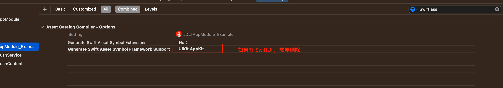

# iOS依赖库版本一致性检测：确保应用兼容性

## 一、背景

在 `iOS` 应用开发的世界里，每次 `Xcode` 更新都带来了新的特性和挑战。最近的 `Xcode 15` 更新不例外，这次升级引入了对 `SwiftUI` 的自动强依赖。`SwiftUI`最低是从 `iOS 13` 开始支持。

这一变化也带来了潜在的兼容性问题。如果您的项目在升级到 `Xcode 15` 后仍需支持 `iOS 13` 以下版本，那么在这些旧设备上运行应用时，将不可避免地遇到崩溃问题。


## 二、问题

**`Xcode15` 升级后 `iOS13` 以下崩溃问题**

### 问题描述及原因

崩溃信息如下：

```
Exception Type:  EXC_CRASH (SIGABRT)
Exception Codes: 0x0000000000000000, 0x0000000000000000
Exception Note:  EXC_CORPSE_NOTIFY
Termination Description: DYLD, Library not loaded: /System/Library/Frameworks/SwiftUI.framework/SwiftUI | Referenced from: /var/containers/Bundle/Application/E96C2AC1-F3D8-4A70-8FDE-FA34A0C73AD3/JDMobileLite.app/JDMobileLite | Reason: image not found
Triggered by Thread:  0
```

Xcode15 默认会在 `Build Setting` 添加 `ASSETCATALOG_COMPILER_GENERATE_ASSET_SYMBOL_FRAMEWORKS` 选项，默认值为：

```
SwitUI UIKit AppKit
```

因为 SwiftUI 是从 iOS13 开始支持，这样导致在以下的设备上运行会崩溃。

官方文档如下：

https://developer.apple.com/documentation/xcode-release-notes/xcode-15-release-notes


### 问题解决

检查一下Asset Catalog Compiler这一项 Generate Swift Asset Symbol Framework Support，把SwiftUI去掉

 


### 问题解决复查

1、重新出包，使用 iOS13以下 的设备安装运行验证；

2、使用 otool 检测 ipa 中的二进制验证：

问题解决前数据如下：

```
$ otool -L JDMobileLite
JDMobileLite:
        ...
        ...
	/System/Library/Frameworks/QuickLook.framework/QuickLook (compatibility version 1.0.0, current version 946.3.2)
	/System/Library/Frameworks/SwiftUI.framework/SwiftUI (compatibility version 1.0.0, current version 5.2.12)
	/System/Library/Frameworks/UserNotifications.framework/UserNotifications (compatibility version 1.0.0, current version 1.0.0)
	...
        ...
```

问题解决后数据如下：

```
$ otool -L JDMobileLite
JDMobileLite:
        ...
        ...
	/System/Library/Frameworks/QuickLook.framework/QuickLook (compatibility version 1.0.0, current version 946.3.2)
	/System/Library/Frameworks/UserNotifications.framework/UserNotifications (compatibility version 1.0.0, current version 1.0.0)
	...
        ...
```

解决方案参考：

https://forums.developer.apple.com/forums/thread/126506

https://stackoverflow.com/questions/57907817/dyld-library-not-loaded-swiftui-when-app-runs-on-ios-12-using-availableios-13


## 三、规避工具

随着 `Xcode` 和 `iOS SDK` 的不断更新，我们作为开发者，面临着一个持续的挑战：确保我们的应用在旧版本的iOS上仍然能够稳定运行。这一挑战的核心在于保持 ***App支持的最低系统版本号*** 与 ***项目依赖的系统库支持最低版本号*** 的一致性。这不仅仅是一个单次的修复问题，而是需要一个系统化的解决方案来持续监控和解决这一问题。以下是实现这一目标的三个关键思路：

1、如何获取到 App 支持的最低系统版本号？

2、如何获取 App 依赖的系统库列表？

3、如何获取这些系统库最低支持的系统版本号？


## 四、工具使用

执行 `main.py`， 并传入 `app` 包的路径即可

```sh
$ python3 main.py -f /Users/denglibing/Downloads/JDMOBILELITE-V6.0.0-100-1337-APPSTORE-d0e2839a/Payload/JDMobileLite.app

==Step1 解析参数
        app_path: /Users/denglibing/Downloads/JDMOBILELITE-V6.0.0-100-1337-APPSTORE-d0e2839a/Payload/JDMobileLite.app
        output: /Users/denglibing/Downloads/JDMOBILELITE-V6.0.0-100-1337-APPSTORE-d0e2839a/Payload

==Step2 通过 sh 脚本获取该 app 依赖的系统库列表（剔除 weak 依赖)）
        执行 sh 脚本获取系统列表信息成功
        系统库列表: ['AVFoundation', 'Accelerate', 'AdSupport', 'AddressBook', 'AddressBookUI', 'AssetsLibrary', 'AudioToolbox', 'CFNetwork', 'CoreFoundation', 'CoreGraphics', 'CoreLocation', 'CoreMedia', 'otion', 'CoreText', 'CoreVideo', 'EventKit', 'Foundation', 'GLKit', 'ImageIO', 'LocalAuthentication', 'MediaPlayer', 'OpenGLES', 'PassKit', 'QuartzCore', 'Security', 'StoreKit', 'SystemConfiguration', 'UIKit', 'VideoToolbox', 'WatchConnectivity', 'AVKit', 'CoreData', 'CoreImage', 'MapKit', 'MessageUI', 'Photos', 'QuickLook', 'iAd', 'SwiftUI']

==Step3 读取 info.plist 文件获取该 app 版本信息
        app_version:6.0.0       app_build:1337  min_ios_version:11.0 

==Step4 developer.apple.com查询获取系统库最低支持版本号，得到异常依赖
	异常依赖：SwiftUI
	!!!请重点排查!!!，不然可能导致低版本系统启动崩溃

本次分析耗时:38.130秒
```

